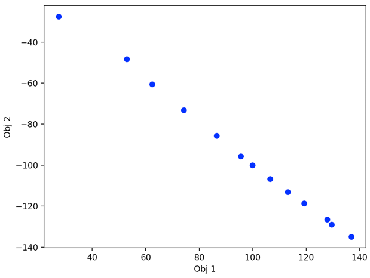

## Multi-Objective Optimization Problem

The Multi-Objective Optimization (MOO) problem could be represented as follows, which includes ```k``` objectives to be optimized, where along with ```m``` inequality and ```e``` equality constraints. The variables **x** are set with lower and upper bounds by $\mathbf{l}$ and $\mathbf{u}$.

$$ \mathop{\rm{Minimize}}\limits_{\rm{\bf{x}}} \\ \\ \mathbf{F(\mathbf{x}}) = [\mathit{F}_1(\mathbf{x}), \mathit{F}_2(\mathbf{x}), ..., \mathit{F}_k(\mathbf{x})]^\mathit{T}$$ 

&ensp; &ensp; &ensp; &ensp; &ensp; &ensp; &ensp; &ensp; &ensp; &ensp; &ensp; &ensp; &ensp; &ensp; &ensp; &ensp; &ensp; &ensp; &ensp; &ensp; &ensp; &ensp; &ensp; &ensp; &ensp; &ensp; 
subject to   $\\ g_j(\mathbf{x}) \leq 0, \\ j = 1, 2, ..., m$

$$ &ensp; &ensp; h_l(\mathbf{x})=0, \\ l = 1, 2, ..., e $$

$$ \mathbf{l} \le \mathbf{x} \le \mathbf{u} &ensp; &ensp; &ensp; &ensp; &ensp; &ensp; &ensp; &ensp; &ensp;$$

Generally, optimization of objectives is minimization or maximization. Since equality constraints can be transformed from two inequality constraints by $g_j(\mathbf{x}) \leq 0$ and $-g_j(\mathbf{x}) \leq 0$, the MOO can only include inequality constraints. 
Common types of variables include float, integer and binary.

## Quick Start
The following shows a concrete example of MOO problem (Chankong and Haimes function [[1], [2]]) with 2 objectives, 2 constraints and 2 variables.

$$ \mathop{\rm{Minimize}}\limits_{\rm{\bf{x}}} \\ \\ \mathit{F}_1(\mathbf{x}) = (x_1 - 2)^2 + (x_2 - 1)^2 + 2 $$

$$ \mathit{F}_2(\mathbf{x}) = 9x_1 - (x_2 - 1)^2 $$

&ensp; &ensp; &ensp; &ensp; &ensp; &ensp; &ensp; &ensp; &ensp; &ensp; &ensp; &ensp; &ensp; &ensp; &ensp; &ensp; &ensp; &ensp; &ensp; &ensp; &ensp; &ensp; &ensp; &ensp; &ensp; &ensp; 
subject to   $\\ x_1^2 + x_2^2 - 225 \leq 0 $

$$ x_1 - 3x_2 + 10 \leq 0 &ensp; &ensp;$$

$$ &ensp; &ensp; -20 \le x_i \le 20, \forall i = 1, 2 $$

The optimization package allows users to define their problems from Python. 
For the details of how to set up problems and how the APIs works internally, please see sections of **how to run MOO** and **APIs in Optimization package** in the later content.

The following is the code for the above example solving by the Weighted Sum method with Grid-Search solver. Before running code, please export the PYTHONPATH as `export PYTHONPATH=~/your_path_to/UDAO2022`.
```python
from optimization.moo.generic_moo import GenericMOO
from utils.optimization.configs_parser import ConfigsParser
import utils.optimization.functions_def as func_def
import utils.optimization.moo_utils as moo_ut

HELP = """
Format: python ws_grid_hcf.py -c <config> -h
    - c : The configuration file location. Default is "examples/optimization/ws_grid/heuristic_closed_form/configs.json"
Example:
    python examples/optimization/ws_grid/heuristic_closed_form/ws_grid_hcf.py -c examples/optimization/ws_grid/heuristic_closed_form/configs.json
"""
# get input parameters
moo_algo, solver, var_types, var_bounds, obj_names, opt_types, const_types, add_params = ConfigsParser().parse_details()
# problem setup
moo = GenericMOO()
moo.problem_setup(obj_names=obj_names, obj_funcs=[func_def.obj_func1, func_def.obj_func2], opt_types=opt_types,
                  const_funcs=[func_def.const_func1, func_def.const_func2], const_types=const_types, var_types=var_types, var_bounds=var_bounds)
# solve MOO problem
po_objs, po_vars = moo.solve(moo_algo, solver, add_params)

print("Pareto solutions:")
print(po_objs)
print("Variables:")
print(po_vars)

if po_objs is not None:
    moo_ut.plot_po(po_objs, n_obj=2)
```

The results are as follows:
```python
Pareto solutions:
[[ 224.99816345 -216.51882461]
 [ 219.0151005  -216.22905826]
 [ 212.39536782 -212.62942557]
 [  22.47189062  -22.64473013]
 [  15.18283849  -13.21303949]
 [  11.15875931   -4.10784614]
 [  10.3996531     4.67084991]]
Variables:
[[-5.45454545 13.93939394]
 [-4.24242424 14.34343434]
 [-2.62626263 14.74747475]
 [-2.22222222  2.62626263]
 [-1.01010101  3.03030303]
 [ 0.2020202   3.43434343]
 [ 1.41414141  3.83838384]]
```


## Overview of optimization package
`optimization` package includes `optimization.moo` package and `optimization.solver` package. `optimization.moo` package provides APIs to access all Multi-Objective Optimization (MOO) algorithms.
`optimization.solver` package includes APIs to support solving Single-objective Optimization (SO) problems and Constrainted single-objective Optimization (CO) problem, which is called by MOO methods internally in `optimization.moo` package.

`optimization.moo` package provides an entry point API `optimization.moo.generic_moo.GenericMOO` to solve MOO problems. It specifies input parameters for an optimization problem and a MOO algorithm. Based on the choice parameter, the appropriate MOO algorithms run internally which are described in details later in the README.md.

```python
class GenericMOO:

    def __init__(self):
        pass

    def problem_setup(self,obj_names: list, obj_funcs: list, opt_types: list, const_funcs: list, const_types: list,
                      var_types: list, var_bounds: list):
        '''
        setup common input paramters for MOO problems
        :param obj_names: list, objective names
        :param obj_funcs: list, objective functions
        :param opt_types: list, objectives to minimize or maximize
        :param const_funcs: list, constraint functions
        :param const_types: list, constraint types ("<=" or "<", e.g. g1(x1, x2, ...) - c <= 0)
        :param var_types: list, variable types (float, integer, binary)
        :param var_bounds: ndarray(n_vars, 2), lower and upper bounds of variables
        :return:
        '''
        self.obj_names = obj_names
        self.obj_funcs = obj_funcs
        self.opt_types = opt_types
        self.const_funcs = const_funcs
        self.const_types = const_types
        self.var_types = var_types
        self.var_bounds = var_bounds

    def solve(self, moo_algo: str, solver: str, add_params: list):
        '''
        solve MOO problems internally by different MOO algorithms
        :param moo_algo: str, the name of moo algorithm
        :param solver: str, the name of solver
        :param add_params: list, the parameters required by the specified MOO algorithm and solver
        :return: po_objs: ndarray(n_solutions, n_objs), Pareto solutions
                 po_vars: ndarray(n_solutions, n_vars), corresponding variables of Pareto solutions
        '''
        if moo_algo == "weighted_sum":
            ...
        elif moo_algo == 'progressive_frontier':
            ...
        elif moo_algo == 'evolutionary':
            ...
        elif moo_algo == "mobo":
            ...
        elif moo_algo == "normalized_normal_constraint":
            ...
        else:
            raise NotImplementedError

        return po_objs, po_vars
```

## How to run MOO
### **Problem setup**

- ##### **Configuration file**:
   
   A `.json` file is necessary for the configurations used in problem setting, 
where it setups all the input parameters. The following is a brief description on the parameters.
For details, please refer to the example file `"examples/optimization/ws_random/heuristic_closed_form/configs.json"`.   
  
   ```yaml
   "moo_algo"         -> the name of the MOO algorithm,` 
   "solver"           -> the name of the solver,` 
   "variables"        -> a list of variables with name, type, lower and upper bounds` 
   "objectives"       -> a list of objectives with name, optimize_trend (e.g. min/max) and type`
   "constraints"      -> a list of constraints with name, type (e.g. "<=", "<")
   "additional_params"-> parameters for a specific algorithm with its solver

   NOTE: if the bounds of variables is inifite, please set it to a concrete number rather than setting it as `inf`
- ##### **Define functions of objectives and constraints**:
   The use-defined optimization problem is set in the file `utils/optimization/functions_def.py`.
The functions of objectives and constraints can either be represented as heuristic closed forms or predictive models (e.g. based on Neural Network).


### **Run MOO**
- First parse the configuration file to obtain input parameters, and then call `optimization.moo.generic_moo.GenericMOO` to return Pareto solutions and the corresponding variables.

```python
from optimization.moo.generic_moo import GenericMOO
from utils.optimization.configs_parser import ConfigsParser
import utils.optimization.functions_def as func_def

# get input parameters
moo_algo, solver, var_types, var_bounds, obj_names, opt_types, const_types, add_params = ConfigsParser().parse_details()
moo = GenericMOO()
# problem setup
moo.problem_setup(obj_names=obj_names, obj_funcs=[func_def.obj_func1, func_def.obj_func2], opt_types=opt_types,
                  const_funcs=[func_def.const_func1, func_def.const_func2], const_types=const_types, var_types=var_types, var_bounds=var_bounds)
# solve MOO problem
po_objs, po_vars = moo.solve(moo_algo, solver, add_params)
```
## **APIs in Optimization package**
The following shows a brief description of APIs in `optimization.moo` and `optimization.solver` packages.

```yaml
   # APIs in moo package (MOO algorithms)
   optimization.moo.generic_moo.GenericMOO                    -> the entry point of all moo algorithms,`
   optimization.moo.based_moo.BaseMOO                         -> the base API includes abstract methods, and all APIs of MOO algorithms extend this API
   optimization.moo.weighted_sum.WeightedSum                  -> API for the Weighted Sum method`
   optimization.moo.progressive_frontier.ProgressiveFrontier  -> API for the Progressive Frontier method`
   optimization.moo.evolutionary.EVO                          -> API for the Evolutionary (NSGA-II) method
   optimization.moo.mobo.MOBO                                 -> API for the Multi-Objective Bayesian Optimization method
   optimization.moo.normalized_normal_constraint.NNC          -> API for the Normalized Normal Constraint method
   
   # APIs in solver package, called internally by MOO algorithms
   optimization.solver.base_solver.BaseSolver                 -> the base API includes abstract methods, and all solver APIs extend this API 
   optimization.solver.grid_search.GridSearch                 -> API for the Grid Search 
   optimization.solver.random_sampler.RandomSampler           -> API for the Random Sampler 
   optimization.solver.mogd.MOGD                              -> API for the Multi-Objective Gradient Descent
   ```
## **MOO Algrithms with Examples**
### **Weighted Sum**

Weighted Sum (WS) method adds different weights on different objectives to show preferences or importance over all objectives. It transforms a MOO problem into a SO. 

In the packages `optimization.moo`, it calls the method `weighted_sum`. 
Within the method, it supports to call the solver `random_sampler` or `grid_search`.

#### **Run Weighted Sum Example**
   The following example calls Weighted Sum algorithm with solver Grid-Search. The functions of objectives and constraints are represented by the heuristic closed form.
   
   1). problem settings shown in 
      `"examples/optimization/ws_grid/heuristic_closed_form/configs.json"` and `utils/optimization/functions_def.py`

   2). set the python path
   `export PYTHONPATH=~/your_path_to/UDAO2022`

   3). run the following command
   ```yaml
   # an example for weighted sum algorithm with Grid-Search solver
   # problem settings are defined in the config.json file and utils/optimization/functions_def.py
   python examples/optimization/ws_grid/heuristic_closed_form/ws_grid_hcf.py -c examples/optimization/ws_grid/heuristic_closed_form/configs.json
```

[1]: https://web.archive.org/web/20190801183649/https://pdfs.semanticscholar.org/cf68/41a6848ca2023342519b0e0e536b88bdea1d.pdf
[2]: https://en.wikipedia.org/wiki/Test_functions_for_optimization#cite_note-Binh97-5