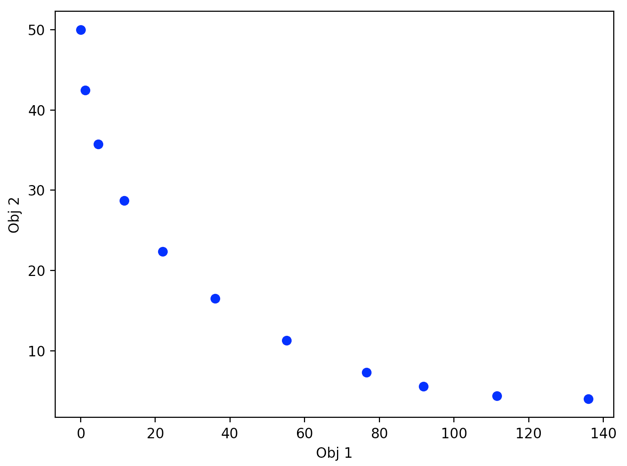

**1. Weighted Sum**
    
Weighted Sum (WS) method calls the method `weighted_sum` in the packages `optimization.moo`. 
Within the method, it calls two solvers `random_sampler` and `grid_search` of package `optimization.solver`.

The `examples/optimization/ws_grid_hcf.py` and `examples/optimization/ws_random_hcf.py` show concrete examples on how to use WS, 
where hcf means the objective and constraint functions of this example is based on the heuristic closed form.
You can define your Multi-Objective Optimization (MOO) problem by following the main steps in the example. By default, we assume a minimization problem.

The following is the main steps in `examples/optimization/ws_grid_hcf.py`:

1). define the variable settings with range and type

    n_vars = 2
    lower = np.array([[-20], [-np.inf]])
    upper = np.array([[np.inf], [20]])
    bounds = np.hstack([lower, upper])
    var_types = ["float", "float"]

**NOTE:** 

1.1). The variable are set within the method of `def _get_input(self, bounds, var_types)` in solvers `random_sampler` and `grid_search` . 
   For the variables with infinite range, currently I set it as 10 just for the example to return feasible 
   solutions within a narrow range. In theory, it should be a very large number (e.g. `1e10`).
   
2). create a class which extends `WeightedSum` API, and rewrite the objective and constraint functions to get objective values and constraint violations.
    
    from optimization.moo.weighted_sum import WeightedSum
    class ExampleWSWithGridSearch(WeightedSum):
        def __init__(self, gs_params, n_objs, debug):
            super().__init__(gs_params, n_objs, debug)
        def _obj_function(self, vars, obj):
            ...
        def _const_function(self, vars):
            ...

3). set necessary parameters for grid_search/random_sampler

    ## for grid_search
    other_params = {}
    other_params["inner_solver"] = "grid_search"
    other_params["num_ws_pairs"] = 10
    gs_params = {}
    gs_params["n_grids_per_param"] = 10
    other_params["gs_params"] = gs_params

4). initialize the example class, and run the solve method

    example = ExampleWSWithGridSearch(other_params, n_objs=2, debug=False)
    po_objs, po_vars = example.solve(bounds, var_types, n_objs=2)

5). print and plot the final results

    print(po_objs)
    print(po_vars)
    if po_objs is not None:
        example.plot_po(po_objs)

**NOTE:** 

Currently, in each solver, I put a test code for the correctness of the methods used.

**2. Progressive Frontier**
    
Progressive Frontier (PF) method calls the MOO method `progressive_frontier` in the packages `optimization.moo`. 
Within the method, it calls the solver `mogd` of package `optimization.solver`.

The `examples/optimization/pf_mogd_hcf.py` shows a concrete example on how to use PF, 
where hcf means the objective and constraint functions of this example is based on the heuristic closed form.
You can define your Multi-Objective Optimization (MOO) problem by following the main steps in the example. By default, we assume a minimization problem.

The following is the main steps in `examples/optimization/pf_mogd_hcf.py`:

1). define the variable settings with range and type

    n_vars = 2
    lower = np.array([[-20], [-np.inf]])
    upper = np.array([[np.inf], [20]])
    bounds = np.hstack([lower, upper])
    var_types = ["float", "float"]

**NOTE:** 

      1.1). The variable bounds are used within the method `def _vars_inv_norm` of the solver `mogd`. 
         For the variables with infinite range, currently I set it as 10 just for the example to return feasible 
         solutions within a narrow range. In theory, it should be a very large number (e.g. `1e10`).
   
2). create a class which extends `ProgressiveFrontier` API.
    
      from optimization.moo.progressive_frontier import ProgressiveFrontier
      class ExamplePFWithMOGD(ProgressiveFrontier):
         def __init__(self, other_params, bounds, n_objs, debug):
            super().__init__(other_params, bounds, debug)
**NOTE:** 

2.1). Currently, the objective and constraint functions are set within `mogd` solver.

3). set necessary parameters for `mogd`

    other_params = {}
    other_params["pf_option"] = "pf_as"
    other_params["inner_solver"] = "mogd"

    mogd_params = {}
    mogd_params["lr"], mogd_params["wd"], mogd_params["max_iter"] = 0.01, 0.1, 500
    mogd_params["patient"], mogd_params["multistart"], mogd_params["processes"] = 20, 1, 0
    other_params["mogd_params"] = mogd_params

**NOTE:** 

      3.1). PF approach supports two versions of algorithms PF-Approximate Sequential (PF-AS)
      and PF-Approximate Parallel (PF-AP), which is indicated by the parameter `"pf_option"`. 
      PF-AS supports to generate solutions sequentially. PF-AP supports to generate solutions parallelly 
      by a) forming multiple grid cells and constructing a Constrained Problem for each cell; 
      b) solving multiple CO problems parallelly (using multi-threading)
      
      3.2) parameter descriptions: "lr" is learning rate, "wd" is weight decay, 
      "max_iter" is the maximum number of iterations. "patient" is the parameter
      to control early stop. 

4). initialize the example class, and run the solve method

    example = ExamplePFWithMOGD(other_params, bounds, n_objs=2, debug=False)
    po_objs, po_vars = example.solve(vars, var_types, n_probes=15, n_objs=2, n_vars = n_vars)

5). print and plot the final results

    print(po_objs)
    print(po_vars)
    if po_objs is not None:
        example.plot_po(po_objs)

