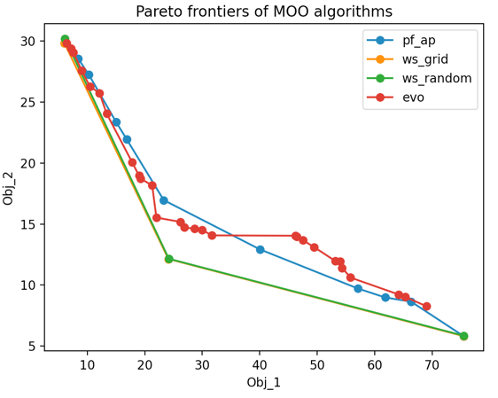
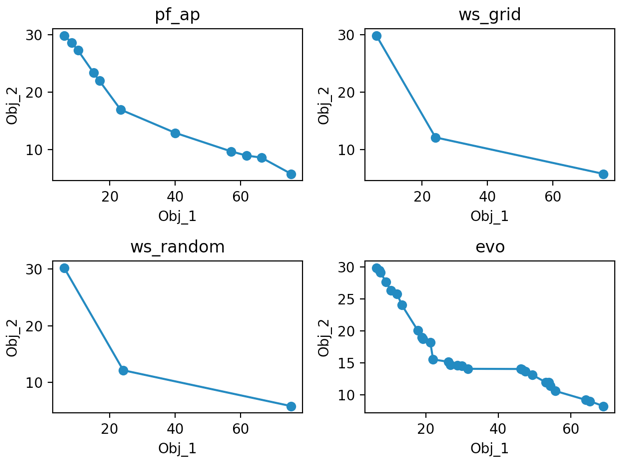
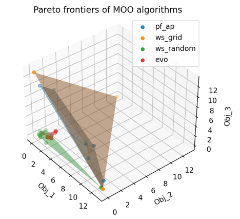
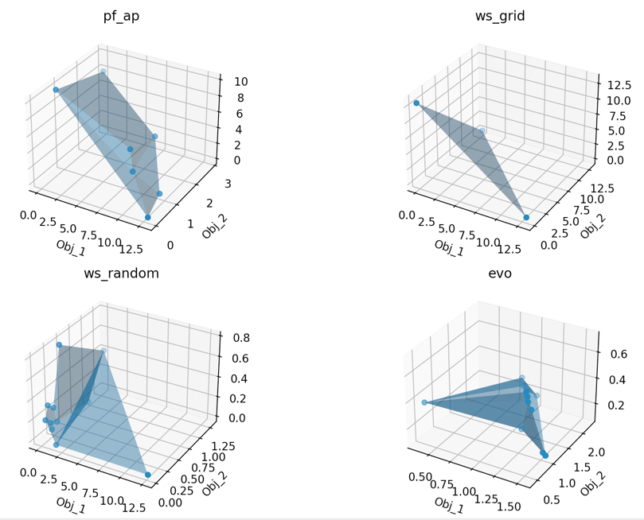

## Optimization
* [Multi-Objective Optimization Problem](#multi-objective-optimization-problem)
* [Quick Start](#quick-start)
* [Overview of the package](#overview-of-the-package)
* [How to run MOO](#how-to-run-moo)
    * [Problem setup](#problem-setup)
    * [Run MOO](#run-moo)
* [APIs in the package](#apis-in-the-package)
* [MOO Algorithms](#moo-algorithms)
* [Examples](#examples)
  * [Heuristic Closed Form - 2D](#heuristic-closed-form---2d)
  * [Gaussian Process Regressor - 2D](#gaussian-process-regressor---2d)
  * [Neural Network - 2D](#neural-network---2d)
  * [Heuristic Closed Form - 3D](#heuristic-closed-form---3d)
* [Features in the next release](#features-in-the-next-release)

## Quick Start

### Installation
```bash
git clone --depth 1 --branch moo-release-v0.1 git@github.com:Angryrou/UDAO2022.git
conda create -n udao2022 python=3.9
conda activate udao2022
pip install -r requirements.txt
```

_Note: we only tested PF-AP for Intel chips on Mac and CentOS._

### Multi-Objective Optimization Problem

The Multi-Objective Optimization (MOO) problem could be represented as follows, which includes `k` objectives to be optimized, where along with `m` inequality and `e` equality constraints. The variables **x** are set with lower and upper bounds by $\mathbf{l}$ and $\mathbf{u}$.

$$ \mathop{\rm{Minimize}}\limits_{\rm{\bf{x}}} \\ \\ \mathbf{F(\mathbf{x}}) = [\mathit{F}_1(\mathbf{x}), \mathit{F}_2(\mathbf{x}), ..., \mathit{F}_k(\mathbf{x})]^\mathit{T}$$ 

&ensp; &ensp; &ensp; &ensp; &ensp; &ensp; &ensp; &ensp; &ensp; &ensp; &ensp; &ensp; &ensp; &ensp; &ensp; &ensp; &ensp; &ensp; &ensp; &ensp; &ensp; &ensp; &ensp; &ensp; &ensp; &ensp; 
subject to   $\\ g_j(\mathbf{x}) \leq 0, \\ j = 1, 2, ..., m$

$$ &ensp; &ensp; h_l(\mathbf{x})=0, \\ l = 1, 2, ..., e $$

$$ \mathbf{l} \le \mathbf{x} \le \mathbf{u} &ensp; &ensp; &ensp; &ensp; &ensp; &ensp; &ensp; &ensp; &ensp;$$

Generally, optimization of objectives is minimization or maximization. 
Constraints include inequality and equaility types.
Common types of variables include `FLOAT`, `INTEGER`, `BINARY` and `ENUM`, where `BINARY` only includes values 0 and 1, `ENUM` type is for multiple (2+) categorical values.

### MOO example
The following shows an MOO problem example (Binh and Korn function [[1], [2]]) with 2 objectives, 2 constraints and 2 variables.

$$ \mathop{\rm{Minimize}}\limits_{\rm{\bf{x}}} \\ \\ \mathit{F}_1(\mathbf{x}) = 4 {x_1}^2 + 4 {x_2}^2 $$

$$ \mathit{F}_2(\mathbf{x}) = (x_1 - 5)^2 - (x_2 - 5)^2 $$

&ensp; &ensp; &ensp; &ensp; &ensp; &ensp; &ensp; &ensp; &ensp; &ensp; &ensp; &ensp; &ensp; &ensp; &ensp; &ensp; &ensp; &ensp; &ensp; &ensp; &ensp; &ensp; &ensp; &ensp; &ensp; &ensp; 
subject to   $\\ (x_1 - 5)^2 + x_2^2 \leq 25 $

$$ (x_1 - 5)^2 + (x_2 + 5)^2 \geq 7.7 &ensp; &ensp;$$

$$ &ensp; &ensp; 0 \le x_1 \le 5, 0 \le x_2 \le 3 $$

The optimization package allows users to define their problems from Python. 
For the details of how to set up problems and how the APIs works internally, please see sections of [How to Run MOO](#how-to-run-moo) and [APIs in the Package](#apis-in-the-package) in the later content.

<details>
<summary>Here is an example for solving the above problem by the Weighted Sum method with the `grid_search` solver.</summary> 

```bash
export PYTHONPATH=$PWD # export PYTHONPATH=~/your_path_to/UDAO2022
python examples/optimization/heuristic_closed_form/ws.py -c examples/optimization/heuristic_closed_form/configs/2d/ws_grid_search.json

# output
#
# Pareto solutions of wl_None:
# [[136.           4.        ]
#  [109.71696766   4.49994898]
#  [ 87.43352719   5.99979594]
#  [ 70.79318437   8.2033466 ]
#  [ 46.43158861  13.42607897]
#  [ 27.63554739  19.73716968]
#  [ 14.87603306  26.44628099]
#  [  6.03775125  34.13570044]
#  [  1.37292113  42.060402  ]
#  [  0.          50.        ]]
# Variables of wl_None:
# [[0.         0.        ]
#  [0.70707071 0.        ]
#  [1.41414141 0.        ]
#  [2.02020202 0.03030303]
#  [2.57575758 0.60606061]
#  [3.13131313 1.15151515]
#  [3.63636364 1.63636364]
#  [4.14141414 2.12121212]
#  [4.5959596  2.57575758]
#  [5.         3.        ]]
# Time cost of wl_None:
# 0.00973200798034668
# Test successfully!
```

The output includes the Pareto solutions and the corresponding variables. The `Pareto solutions` is stacked by a set of Pareto solutions with each column representing the value of one objective.
The `Variables` is stacked by a set of configurations with each column representing the value of one input parameter.
In the above example, we got 11 Pareto solutions and the first Pareto solution is `(136, 4)` in the 2D objective space, corresponding to the 2D variable `(x_1, x_2) = (5, 3)`

The results are also shown in the figure below, where the blue points are the Pareto solutions returned by the Weighted Sum method with te `grid_search` solver in the 2D objective space.


</details>

## Overview of the Package
The `optimization` package includes the `optimization.moo` package and the `optimization.solver` package. The `optimization.moo` package provides APIs to access all Multi-Objective Optimization (MOO) methods.
The `optimization.solver` package is called by MOO methods internally in `optimization.moo` package. 

The `optimization.moo` package provides an entry point at [`optimization.moo.generic_moo.GenericMOO`](../../optimization/moo/generic_moo.py) to solve MOO problems. It specifies input parameters for an optimization problem and an MOO algorithm. Based on the choice parameter, the appropriate MOO algorithms run internally.

## How to Run MOO

### Problem Setup

1. create a directory under `example/optimization/<model>`, e.g., `example/optimization/heuristic_closed_form/`.
2. add a **configuration file** to set up all the parameters for the MOO method.
   <details>
    <summary><a href="./../../examples/optimization/heuristic_closed_form/configs/2d/ws_grid_search.json">Here</a> is 
      the configuration file for the example in the <a href="#quick-start">Quick Start</a>.</summary>
   
      ```json
    {
      "moo_algo": "weighted_sum",
      "solver": "grid_search",
      "variables": [
        {
          "name": "v1",
          "type": "FLOAT",
          "min": 0,
          "max": 5
        },
        {
          "name": "v2",
          "type": "FLOAT",
          "min": 0,
          "max": 3
        }
      ],
      "objectives": [
        {
          "name": "obj_1",
          "optimize_trend": "MIN",
          "type": "FLOAT"
        },
        {
          "name": "obj_2",
          "optimize_trend": "MIN",
          "type": "FLOAT"
        }
      ],
      "constraints": [
        {
          "name": "g1",
          "type": "<="
        },
        {
          "name": "g2",
          "type": ">="
        }
      ],
      "additional_params":
        {
          "jobIds_path": "examples/optimization/heuristic_closed_form/all_job_ids",
          "n_probes": 12,
          "solver_params": {
            "n_grids_per_var": [100, 100]
          }
        }
    }
      ```
      NOTE: if the bounds of variables is infinity, please set it to a concrete number rather than setting it as `inf`
    </details>
3. define the functions of objectives and constraints. The functions need to be subdifferentiable, e.g., a close-form formula or a Neural Network model. 
The [Quick Start](#quick-start) example uses [Binh and Korn function][2] provided by our [package](../../examples/optimization/heuristic_closed_form/model.py).

### Run MOO

To run the MOO over the defined problem, construct a python file to invoke `optimization.moo.generic_moo.GenericMOO` with 
the pre-defined functions for the objectives and constraints, and run it with the configuration file.

```bash
export PYTHONPATH=$PWD
# python example/optimization/<model>/<moo-method>.py -c <configuration-file>
python examples/optimization/heuristic_closed_form/ws.py -c examples/optimization/heuristic_closed_form/configs/2d/ws_grid_search.json
```

## APIs in the Package

The following shows a tree structure of APIs in `optimization` package, where `moo` and `solver` are two packages for MOO algorithms and solvers respectively;
`model` provides a general API for user to inherit.
```bash
├── __init__.py
├── moo
│   ├── __init__.py
│   ├── base_moo.py
│   ├── evolutionary.py
│   ├── generic_moo.py
│   ├── progressive_frontier.py
│   └── weighted_sum.py
├── model
│   ├── __init__.py
│   └── base_model.py
└── solver
    ├── __init__.py
    ├── base_solver.py
    ├── grid_search.py
    ├── mogd.py
    └── random_sampler.py
```

Within the `moo` package, the `generic_moo` provides the entry point of all moo algorithms. The `base_moo` is the base API includes abstract methods, and all APIs of MOO algorithms extend this API. 
`weighted_sum`, `progressive_frontier`, `evolutionary` are MOO algorithms supported in the `optimization` package.

Within the `solver` package, the `base_solver` provides the base API includes abstract methods, and all solver APIs extend this API.
`grid_search`, `random_sampler`, `mogd` (Multi-Objective Gradient Descent (MOGD)) are solvers supported in the `optimization` package.

Within the `model` package, the `base_model` provides the base API includes abstract methods used in predictive models.

## Supported Optimization Problems
Currently, the `optimization` package supports to minimize/maximize problems with 2 and 3 objectives with/without constraints.

Either objectives or constraint functions are supported to be represented as heuristic closed form (HCF) or predictive models (e.g. gaussian process regressors (GPR) or neural network (NN)).

To represent the constraints, the constraint function g(x) follows a format of `g(x) - C >= 0` (or `==`, `<=`), where `C` is a constant. 

For variables, the package supports `float`, `integer`, `binary` and `enum` (e.g. a variable is only supported with 2+ discrete values).

## MOO Algorithms

The package provides MOO algorithms including:

- [Weighted Sum (WS)][3] method adds different weights on different objectives to show the preferences or importance over all objectives. It transforms an MOO problem into a single-objective optimization problem. Our weighted sum works with the solver `grid_search` and `random_sampler`.
- [Progressive Frontier (PF)](https://hal.inria.fr/hal-02549758/document) includes two approaches: PF-Approximation Sequential (PF-AS) and PF-Approximation Parallel (PF-AP). 
  PF-AS generates Pareto points sequentially and consistently by exploring uncertainty space with maximum volume.
  PF-AP generates Pareto points parallelly by exploring multiple sub-uncertainty-space at the same time. Both transform a MOO into a series of constrained single-objective optimization problems. By default, we use `PF-AP`.
- Evolutionary (Evo) algorithms solve optimization problems by utilizing genetic operations (e.g. selection, crossover, mutation) over populations. 
  [NSGA-II](https://web.njit.edu/~horacio/Math451H/download/2002-6-2-DEB-NSGA-II.pdf) is a classic evolutionary algorithm to solve MOO problem, which aims to generate a set of Pareto solutions while maintaining the diversity.
  In the current repository, it calls the library [Platypus][1] with NSGA-II algorithm. 
  
Note:

- `MOGD` solver requires that at least one objective should always be with positive values. 
- `PF`: `PF` calls `MOGD` solver and by default we use `Pf-AP`. If there is any objective returns negative value or to be maximized, please treat it as a constraint rather than the objective to be optimized.
## Examples

We provide three examples to do MOO, including
- [2D] when two objectives are both in the form of heuristic closed form (HCF)
- [2D] when two objectives are both from gaussian process regressors (GPR)
- ~~[2D] (bug) when two objectives can be either in the form of Neural Network (NN) or HCF.~~
- [3D] when three objectives are all in the form of HCF

### Heuristic Closed Form - 2D 

Following the Binh and Korn function, when we have two objectives (both are  
[heuristic closed form (HCF)](../../examples/optimization/heuristic_closed_form/model.py)
and two constraints (two HCFs), 
we show the execution code and results of different MOO methods with solvers below.
 
```bash
export PYTHONPATH=$PWD

# 1. WS (with two solvers `grid_search` and `random_sampler`)
python examples/optimization/heuristic_closed_form/ws.py -c examples/optimization/heuristic_closed_form/configs/2d/ws_grid_search.json
python examples/optimization/heuristic_closed_form/ws.py -c examples/optimization/heuristic_closed_form/configs/2d/ws_random_sampler.json
# 2. PF-AP (with MOGD)
python examples/optimization/heuristic_closed_form/pf.py -c examples/optimization/heuristic_closed_form/configs/2d/pf_mogd.json
# 3. EVO (with NSGA-II)
python examples/optimization/heuristic_closed_form/evo.py -c examples/optimization/heuristic_closed_form/configs/2d/evo.json
```

Pareto Frontiers of different MOO methods.
<p float="left">
  
  
</p>

### Gaussian Process Regressor - 2D

When we have two objectives and two constraints (all are [GPR models](../../examples/optimization/gaussian_process_regressor/model.py)),
we show the execution code and results of different MOO methods with solvers below.

```bash
export PYTHONPATH=$PWD

# 1. WS (with two solvers `grid_search` and `random_sampler`)
python examples/optimization/gaussian_process_regressor/ws.py -c examples/optimization/gaussian_process_regressor/configs/2d/ws_grid_search.json
python examples/optimization/gaussian_process_regressor/ws.py -c examples/optimization/gaussian_process_regressor/configs/2d/ws_random_sampler.json
# 2. PF-AP (with MOGD)
python examples/optimization/gaussian_process_regressor/pf.py -c examples/optimization/gaussian_process_regressor/configs/2d/pf_mogd.json
# 3. EVO (with NSGA-II)
python examples/optimization/gaussian_process_regressor/evo.py -c examples/optimization/gaussian_process_regressor/configs/2d/evo.json
```  

Pareto Frontiers of different MOO methods.
<p float="left">
  
  
</p>

### ~~Neural Network - 2D~~

Bug detected. We will update in the next release.

### Heuristic Closed Form - 3D 
Following the [DTLZ1](https://pymoo.org/problems/many/dtlz.html#DTLZ1) problem, when we have three objectives in the form of [heuristic closed form (HCF)](../../examples/optimization/heuristic_closed_form/model.py)
without any constraints, we show the execution code and results of different MOO methods with solvers below.

```bash
export PYTHONPATH=$PWD

# 1. WS (with two solvers `grid_search` and `random_sampler`)
python examples/optimization/heuristic_closed_form/ws.py -c examples/optimization/heuristic_closed_form/configs/3d/ws_grid_search.json
python examples/optimization/heuristic_closed_form/ws.py -c examples/optimization/heuristic_closed_form/configs/3d/ws_random_sampler.json
# 2. PF-AP (with MOGD)
python examples/optimization/heuristic_closed_form/pf.py -c examples/optimization/heuristic_closed_form/configs/3d/pf_mogd.json
# 3. EVO (with NSGA-II)
python examples/optimization/heuristic_closed_form/evo.py -c examples/optimization/heuristic_closed_form/configs/3d/evo.json
```

<p float="left">
  
  
</p>

## Features in the Next Release

check this [issue](https://github.com/Angryrou/UDAO2022/issues/18)

[1]: https://web.archive.org/web/20190801183649/https://pdfs.semanticscholar.org/cf68/41a6848ca2023342519b0e0e536b88bdea1d.pdf
[2]: https://en.wikipedia.org/wiki/Test_functions_for_optimization#cite_note-Binh97-5
[3]: http://www.ccad.uiowa.edu/DRMDP/CDContents/Papers/Other/MOO%20survey%20-%20Marler%202004.pdf