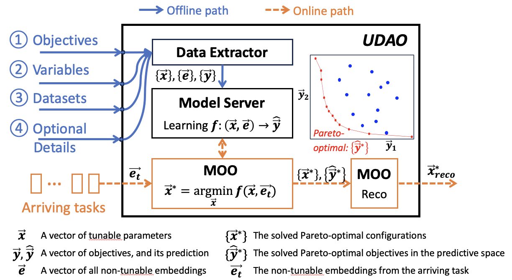

* [The end-to-end usage of UDAO](#the-end-to-end-usage-of-udao)
    * [Diagram](#diagram)
    * [Input/Output Details](#inputoutput-details)
    * [A Desired Example](#a-desired-example)
* [Current code base](#current-code-base)
    * [Dataset](#dataset)
    * [Model](#model)
    * [Optimization](#optimization)
* [Coding work to be done](#Coding-work-to-be-done)
    * [Data Processing Module](#data-processing-module)
    * [Modeling Module](#modeling-module)
    * [Optimization Module](#optimization-module)

## The end-to-end usage of UDAO

### Diagram
The diagram of our UDAO system is as follows. We aim to use our developed Python library `udao` to solve the Multi-objective Optimization (MOO) problem given the user-defined optimization problem and datasets.



### Input/Output Details

We introduce the Input/Output details of UDAO in the setup procedure and tuning procedure.

#### Setup Procedure (offline path)

**Inputs:** 

1. the *objectives*, including the target objectives to be optimized with their optimization directions.
2. the *variables*, including the decision (tunable) parameters, denoted as a *configuration*, and the non-decision (fixed) parameters, denoted as a *preset*.
3. the *datasets* for training, including
   - the location of each dataset.
   - the schema (data types of each feature) of each dataset.
   - the structure of the datasets. E.g., how to join different datasets to a joint dataset for training.
4. optional details of UDAO, including
   - the model architecture, such as `MLP`, `TreeLSTM`, `GTN`, etc.
   - the MOO algorithm, such as `Weighted Sum (ws)`, `Progressive Frontier (pf)`, `Evolutionary Algorithm (evo)`, etc.
   - the MOO solver, such as `Multi-objective Gradient Descent (mogd)`, `Random Sampling (rs)`, `Latin Hypercube Sampling (lhs)`, etc.
   - the optimization preference on the returned configuration. The user-defined weights or our internal weights

**Output:** the predictive models $f$ that estimate every objective value $\widehat{\vec{y}}_i$ given the tunable parameters $\vec{x}$ and the non-tunable embeddings $\vec{e}$. 

$$\widehat{\vec{y}} = f(\vec{x}, \vec{e})$$

#### Tuning Procedure (online path)

**Input:** the *arriving task* that can be summarized as the non-tunable embedding $\vec{e_t}$.

**Ouputs:** the recommended configuration $\vec{x}^*_{reco}$ that can achieve Pareto-optimal with the optimization preferences on different objectives.
     

### A Desired Example
An desired way to use UDAO in a`udao` package

```python
# !pip install udao
from udao import dataset, model, moo
from datasets import Dataset
import pickle

# -------- Setup Procedure --------

# [INPUT]

# 1. define objectives 
o1 = moo.Objective(name="latency", direction="-1")
o2 = moo.Objective(name="cost", direction="-1")

# 2. define variables
x1 = moo.Variable(name="cores_per_exec", tunable=True)
x2 = moo.Variable(name="mem_per_exec", tunable=True)
x3 = moo.Variable(name="exec_num", tunable=True)
p1 = moo.Variable(name="job_id", tunable=False)
p2 = moo.Variable(name="preset_1", tunable=False)
p3 = moo.Variable(name="preset_2", tunable=False)

# 3. define datasets
ds1 = dataset.UdaoDataset(path="./system_states.csv", schema={"id": "INTEGER", "s1": "FLOAT", ...})
ds2 = dataset.UdaoDataset(path="./variables.csv", schema={"id": "INTEGER", "x1": "FLOAT", ...})
ds3 = dataset.UdaoDataset(path="./query_plan_index.csv", schema={"id": "INTEGER", "topology_id": "INTEGER", ...})
ds = dataset.join([ds1, ds2, ds3], on_common_feat="id")


class MyDataset(dataset.UdaoDataset):  # construct dataset for training with customized constructor
    def __init__(self, ds=ds, additional_feat_path="./operator_feats.pkl"):
        ...

    @staticmethod
    def collate(samples):
        """customize the data construction"""
        ...


# A pipeline split dataset to train/val/test split, drop unnecessary columns, handle categorical features,
# data normalization. Return a dict of DataLoaders for tr/val/te sets and the normalization meta info.
dataloaders, normalization_meta = dataset.pipeline(
    ds=MyDataset(ds),
    tr_val_te_split=[0.8, 0.1, 0.1],
    sel_cols=["id", "topology_id", ..., "s1", ..., "x1", ...],
    objs=["latency", "cost"],
    normaliztion="standard"
)

# 4. optimal details
net_params = {...}  # hyperparameters for model structure
mw = model.ModelWraper(type="MLP", net_params, ...)  # (a) model architecture
moo_algo = moo.algo.PF(enable_parallel=True)  # (b) moo algorithms and solvers 
moo_solver = moo.solver.MOGD(alpha=0.01)  # (c) moo solver 
moo_preference = moo.Prefenrence(func=moo.wun)  # (d) optimization preference

# [OUTPUT]

# trains the models internally in `mw`
learning_params = {...}  # hyperparameters for learning
mw.fit(
    train_set=dataloaders["tr"],
    val_set=dataloaders["val"],
    loss=model.metric.WMAPE,
    learning_params=learning_params,
    ...
)


# -------- Tuning Procedure --------

# [INPUT]

# features for the arriving task
query_plan = "{...}"
t = [query_plan, p1, p2, ...]  # t is the representation of the arriving task for optimization 
e = mw.get_embedding(t)

# [OUTPUT]

# the recommended configuration
x_reco = moo.solve(
    obj_funcs=mw.get_predictive_functions([o1, o2]),
    configuration=[x1, x2, x3],
    non_tunable_emb=e,
    moo_algo=moo_algo,
    moo_solver=moo_solver,
    moo_preference=moo_preference,
    constraints=[]
)

```

## Current code base

### Dataset

1. A TPCH trace with 100K data points, including 
   - A tabular dataset with schema (fact table)
   - A customized graph-involved dataset, in the key-value pair form of `{tid: [dgl.DGLGraph, operator_feat_matrix]}` (dimension table)
   - A customized data loading method that joins the tabular dataset and the graph-involved dataset on-the-fly to support mini-batch training.    

2. [Separate code files](https://github.com/Angryrou/UDAO2022/blob/trace-parsing-and-modeling-spark/examples/trace/spark-parser) to construct graph data and tabular data from the raw traces. However, this part can be dropped in our Python library since different datasets may require different construction methods. Instead, we plan to use the same dataset structure to unify the training and optimization processes.

### Model

1. We have implemented various models' architecture in `PyTorch`, including MLP, GTN, GCN, GATv2, and more. Find these implementations [here](https://github.com/Angryrou/UDAO2022/tree/trace-parsing-and-modeling-spark/model/architecture).

2. We have designed a complete [pipeline](https://github.com/Angryrou/UDAO2022/blob/7d9eff4ad8bb2b276b2f27522f6b67d9e3b9c205/utils/model/utils.py#L1039) for model training, which includes the following steps:
    - Model setup
    - Data setup
    - Training component setup (e.g., training optimizer, log, loss function, etc.)
    - Training (iteratively training the model)

### Optimization

1. [An initial Multi-Objective Optimization (MOO) module](https://github.com/Angryrou/UDAO-release/blob/main/docs/optimization/README.md) (released)
    ```python
    ├── __init__.py
    ├── moo
    │   ├── __init__.py
    │   ├── base_moo.py
    │   ├── evolutionary.py
    │   ├── generic_moo.py # (entry point)
    │   ├── progressive_frontier.py
    │   └── weighted_sum.py
    ├── model
    │   ├── __init__.py
    │   └── base_model.py
    └── solver
        ├── __init__.py
        ├── base_solver.py
        ├── grid_search.py
        ├── mogd.py
        └── random_sampler.py
    ```
    - Currently, the `model` submodule in this MOO module is isolated from our modeling part. One solution to connect them is to inherit all the built-in models from the modeling part to the `BaseModel` in `base_model.py`.
    - To demonstrate the capabilities of the MOO module, we provide 3-4 separate examples that include closed-form models, GPR models, and tiny neural networks. 

## Coding work to be done

We aim to integrate our code into a Python library called `udao`, making it accessible for users to install and utilize through a simple `pip install udao` command. The `udao` library is designed to offer three core modules:

1. Data Processing Module (`from udao import dataset`)

2. Modeling Module (`from udao import model`)

3. Optimization Module (`from udao import moo`)

We summarize the coding work into three categories. 

### Data Processing Module

1. The classes and functions (refactor into seperate files if needed)
    ```python
    from abc import ABCMeta
    from sklearn.preprocessing import StandardScaler
    from datasets import Dataset
    from torch.utils.data import DataLoader
    
    
    class UdaoDataset(object, metaclass=ABCMeta):
        """ tabular dataset"""
    
        def __init__(self, path: str, schema: dict):
            ...
    
        @staticmethod
        def collate(samples):
            ...
    
    
    def join(datasets: list[UdaoDataset], on_common_feat: str) -> UdaoDataset:
        """join a list of datasets on a common feature (attribute)"""
        ...
    
    
    def pipeline(data: UdaoDataset, tr_val_te_split: list[float], sel_cols: list[str],
                 objs: list[str], normalization: str) -> [dict[str, DataLoader], dict]:
        """
        a pipeline to do train/val/test split, drop unnecessary columns, handle categorical features,
        and data normalization. Return a dict of DataLoaders for tr/val/te sets and the normalization meta info.
        """
        ...
    ```

2. Integrate a TPCH dataset (for white-box modeling) and a TPCxBB dataset (for black-box modeling) in the designed module as built-in choices.

3. Construct a synthetic toy example of adding a customized Dataset.

### Modeling Module

1. The classes and functions (refactor into separate files if needed)
    
    ```python
    # model.py
    from abc import ABCMeta
    import torch as th
    import torch.nn as nn
    from datasets import Dataset
    
    
    class ModelWraper():
        def __init__(self, type: str, net_params: dict, *args):
            self.model = get_model_by_type(type, net_params)
    
        def fit(self, train_set: Dataset, val_set: Dataset, loss: WMAPE, learning_params: dict, *args):
            ...
    
        def get_predictive_function(self, obj: str) -> UdaoModel:
            ...
    
        def get_predictive_functions(self, objs: list[str]) -> list[UdaoModel]:
            """return a list of `nn.Module` instances"""
            ...
    
        def get_embedding(self, t: object) -> th.Tensor:
            """
            t represents the input of the arriving task. Notice that 
            - In the black box approach, we can assume that UDAO works only for queries that have occurred before, for which we 
              can use the query id in `t` to extract its encoding or previous trace to generate the encoding.
            - in the white box approach, `t` includes the query plan.      
            """
            ...
    
    
    def get_model_by_type(type: str, net_params: dict) -> UdaoModel:
        ...
    
    
    # model.metric.*
    class ModelMetric(object, metaclass=ABCMeta):
        ...
    
    
    class WMAPE(ModelMetric):
        ...
    
    
    # model.architecture.*
    class UdaoEmbedder(nn.Module, metaclass=ABCMeta):
        ...
    
    
    class UdaoRegressor(nn.Module, metaclass=ABCMeta):
        ...
    
    
    class UdaoModel(nn.Module, metaclass=ABCMeta):
        def __init__(self, embedder: UdaoEmbedder, regr: UdaoRegressor):
            super().__init__()
            ...
    
    
    class GTN(UdaoEmbedder):
        ...
    
    
    class AutoEncoder(UdaoEmbedder):
        ...
    
    
    class Averager(UdaoEmbedder):
        ...
    
    
    class MLP(UdaoRegressor):
        ...
    
    
    class AveragerMLP(UdaoModel):
        ...
    
    
    class GTN_MLP(UdaoModel):
        ...
    
    
    class AutoEncoderMLP(UdaoModel):
        ...
    
    ```

2. Integrate our built-in models (embedders and regressors) as listed in the above script for 
   - the black-box modeling approach
   - the white-box modeling approach
    
3. Construct a synthetic toy example of adding a customized Models.

### Optimization Module

1. The classes and functions (refactor into seperate files if needed)
    ```python
    # moo.py
    # Author(s): Chenghao Lyu <chenghao at cs dot umass dot edu>
    #
    # Description: TODO
    #
    # Created at 04/08/2023
    
    
    from abc import ABCMeta
    import torch as th
    import numpy as np
    from typing import Sequence, Iterable
    
    
    class Objective():
        ...
    
    
    class Variable():
        ...
    
    
    class Constraint():
        ...
    
    
    class Preference():
        ...
    
    
    def solve(
            obj_funcs: list[func],
            configuration: list[Variable],
            non_tunable_emb: th.Tensor,
            moo_algo: MOOAlgo,
            moo_solver: MOOSolver,
            moo_preference: Preference,
            constraints: list[Constraint]
    ) -> list[Variable]:
        ...
    
    
    # moo.algo.*
    class MOOAlgo(object, metaclass=ABCMeta):
        ...
    
    
    class PF(MOOAlgo):
        ...
    
    
    class WS(MOOAlgo):
        ...
    
    
    class EVO(MOOAlgo):
        ...
    
    
    # moo.solver.*
    class MOOSolver(object, metaclass=ABCMeta):
        ...
    
    
    class MOGD(MOOSolver):
        ...
    
    
    class LHS(MOOSolver):
        ...
    
    
    class RS(MOOSolver):
        ...
    
    
    # moo.utils.*
    def filter_pareto_optimal(objs: Iterable[Sequence[int]]) -> Iterable[Sequence[int]]:
        ...
    
    
    def plot(objs: np.ndarray, fig_type: str):
        ...
    
    
    def wun(objs: Iterable[Sequence[int]], preferences: Preference) -> [int, Sequence[int]]:
        """apply weighted utopia nearest method to get the objectives recommendation with its index in `objs`"""
        ...
    
    ```

2. Integrate our existing MOO toy examples (including the optimization problem from TPCH dataset and model) 