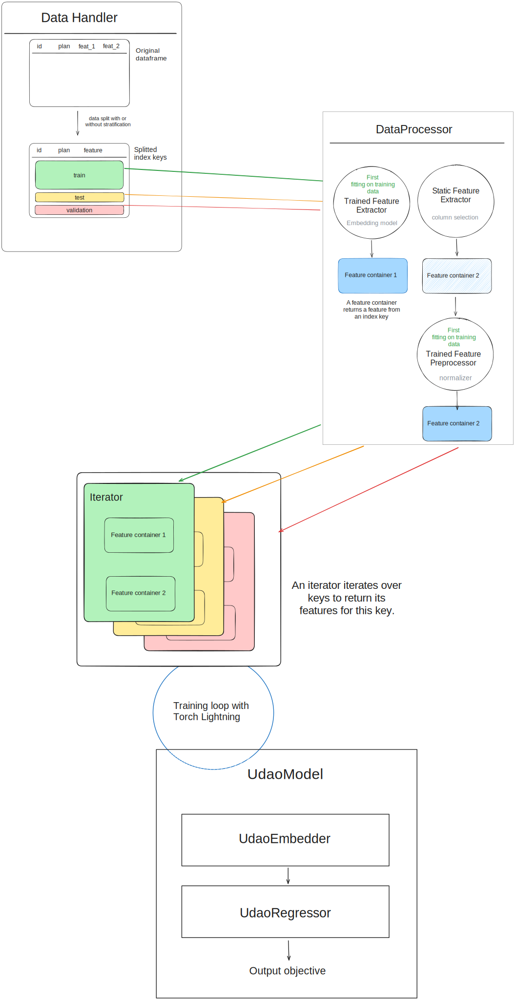

========================
Data processing
========================

UDAO provides a data processing pipeline that can be used to prepare data for training.
While the tools provided are generic, the provided extractors are tailored to the use case of manipulating graphs and their metadata.

Feature extraction
------------------

A feature extractor extracts a certain kind of information from the main data source, which is expected to be a dataframe.
There are two types of feature extractors:

* :py:class:`~udao.data.extractors.base_extractors.TrainedFeatureExtractor` must first be fitted on the training data

* :py:class:`~udao.data.extractors.base_extractors.StaticFeatureExtractor` are applied independently on any split of the data

All feature extractors should implement one of these interfaces.

A feature extractor is expected to return a feature container of type :py:class:`~udao.data.containers.base_container.BaseContainer` that stores the extracted features per sample.
A container is used to link an index key to the feature for the corresponding sample. It does not make any assumption on the type of the feature returned, except that one sample has one such feature.

Building an iterator
--------------------

The iterator is the main output of the data processing pipeline: it iterates over the data and returns all features for the current sample.
As such, it is expected to have as attributes:

* a list of keys
* a list of feature containers as attributes.

The :py:class:`~udao.data.iterators.base_iterator.BaseDatasetIterator` class enforces these requirements as well as other utilitary methods to prepare the data for interaction with PyTorch.

The :py:meth:`~udao.data.iterators.base_iterator.BaseDatasetIterator.get_dataloader` returns a torch dataloader that can directly be used for training.
Iterators can also implement a custom :py:meth:`~udao.data.iterators.base_iterator.BaseDatasetIterator.collate` method to define how to batch features from different samples in the dataloader.

Additional processing
---------------------

Once a feature is extracted and before it is returned by the iterator, it can be further processed by a preprocessor.
Typically, this is used to apply a transformation to the feature, such as a normalization (:py:class:`~udao.data.preprocessors.normalize_preprocessor.NormalizePreprocessor`).

Full data pipeline
------------------

The :py:class:`~udao.data.handler.data_handler.DataHandler` class is a wrapper around the data processing pipeline.
It:

* performs the split between training, testing and validation data
* applies the feature extractors on the data
* applies any preprocessing on the resulting features
* creates iterators for each split based on the features.

Setting up a simple tabular data pipeline
-----------------------------------------

To process a dataframe for training, with column selection and normalization, one can first define the iterator::

  from udao.data.iterators import BaseDatasetIterator

  class MyIterator(BaseDatasetIterator):
      """Iterator on tabular data, with objectives

      Parameters
      ----------
      keys : Sequence[str]
          Keys of the dataset, used for accessing all features

      features : TabularContainer
          Container for the features

      objectives : TabularContainer
          Container for the objectives

      """

      def __init__(
          self,
          keys: Sequence[str],
          features: TabularContainer,
          objectives: TabularContainer,
      ):
          self.keys = keys
          self.features = features
          self.objectives = objectives

      def __len__(self) -> int:
          return len(self.keys)

      def __getitem__(self, idx: int) -> Any:
          key = self.keys[idx]
          return self.features.get(key), self.objectives.get(key)

You can then set up the data handler, based on the iterator. Here we use :py:func:`~udao.data.handler.data_handler.create_data_handler_params` to generate the parameters
This enables to obtain a training dataloader ready for model training::

  from udao.data.handler import DataHandler, create_data_handler_params, FeaturePipeline
  from udao.data.extractors import TabularFeatureExtractor, select_columns
  from udao.data.preprocessors import NormalizePreprocessor
  from sklearn.preprocessing import MinMaxScaler
  from .iterators import MyIterator

  params_getter = create_data_handler_params(MyIterator)
  params = params_getter(
    index_column="idx",
    features=FeaturePipeline(
        extractor=(TabularFeatureExtractor, [select_columns, {"columns": ["k1", "k2", "k3"]}])
        ,
        preprocessors=[(NormalizePreprocessor, [MinMaxScaler()])],
      ),
    objectives=FeaturePipeline(
        extractor=(TabularFeatureExtractor, [select_columns, {"columns": ["latency"]}])
        preprocessors=None,
      ),
    )
    dh = data_handler.from_csv("data.csv", params)
    iterators = dh.get_iterators()
    # iterators is a dict with keys "train", "test", "val"
    # each value is an instance of MyIterator
    training_dataloader = iterators["train"].get_dataloader(batch_size=32)

This training dataloader can then be used to train a model.
