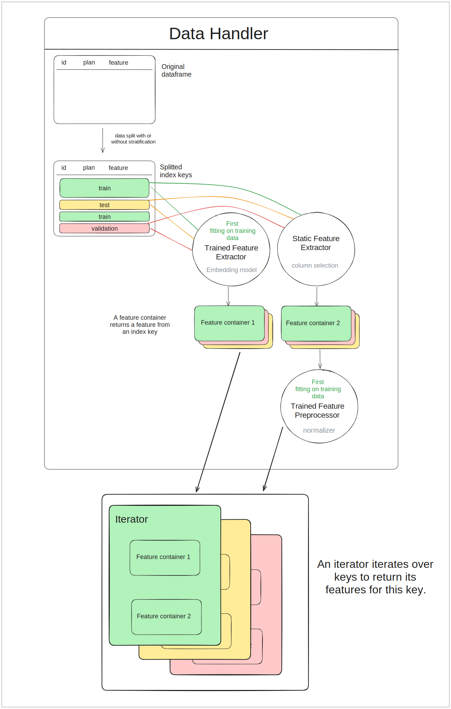

========================
Data processing
========================

UDAO provides a data processing pipeline that can be used to prepare data for training.

Feature extraction
------------------

A feature extractor extracts a certain kind of information from the main data source, which is expected to be a dataframe.
There are two types of feature extractors:

* :py:class:`~udao.data.extractors.base_extractors.TrainedFeatureExtractor` must first be fitted on the training data

* :py:class:`~udao.data.extractors.base_extractors.StaticFeatureExtractor` are applied independently on any split of the data

All feature extractors should implement one of these interfaces.

A feature extractor is expected to return a feature container of type :py:class:`~udao.data.containers.base_container.BaseContainer` that stores the extracted features per sample.
A container is used to link an index key to the feature for the corresponding sample. It does not make any assumption on the type of the feature returned, except that one sample has one such feature.

Iterator
--------

The iterator is the main output of the data processing pipeline: it iterates over the data and returns all features for the current sample.
As such, it is expected to have attributes:

* a list of keys
* a list of feature containers as attributes.

The :py:class:`~udao.data.iterators.base_iterator.BaseDatasetIterator` class enforces these requirements as well as other utilitary methods to prepare the data for interaction with PyTorch.

The :py:meth:`~udao.data.iterators.base_iterator.BaseDatasetIterator.get_dataloader` returns a torch dataloader that can directly be used for training.
Iterators can also implement a custom :py:meth:`~udao.data.iterators.base_iterator.BaseDatasetIterator.collate` method to define how to batch features from different samples in the dataloader.

Full data pipeline
------------------

The :py:class:`~udao.data.handler.data_handler.DataHandler` class is a wrapper around the data processing pipeline.
It:

* performs the split between training, testing and validation data
* applies the feature extractors on the data
* applies any preprocessing on the resulting features
* creates iterators for each split based on the features.

