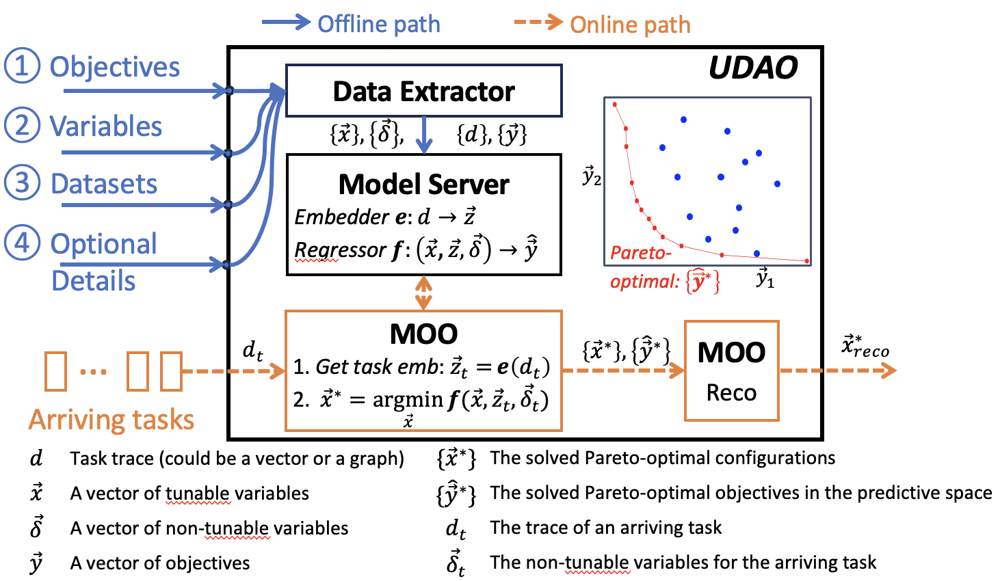

============
Introduction
============

Objective
---------
The `udao` Python library aims to solve a Multi-objective Optimization (MOO)
problem given the user-defined optimization problem and datasets.

The diagram of the UDAO pipeline is as follows.

Modules
-------

There are three main components in the UDAO pipeline:

* :doc:`Data processing <../user_guide/data_processing>`: The data preprocessing component is responsible forprocessing the input datasets and generating the data structures required by the optimization component.
* :doc:`Modeling <../user_guide/model>`: The model training component is responsible for training the models that will act as functions for the optimization component.
* :doc:`Modeling <../user_guide/optimization>`: The optimization component is responsible for solving the MOO problem given the user-defined optimization problem and datasets.
